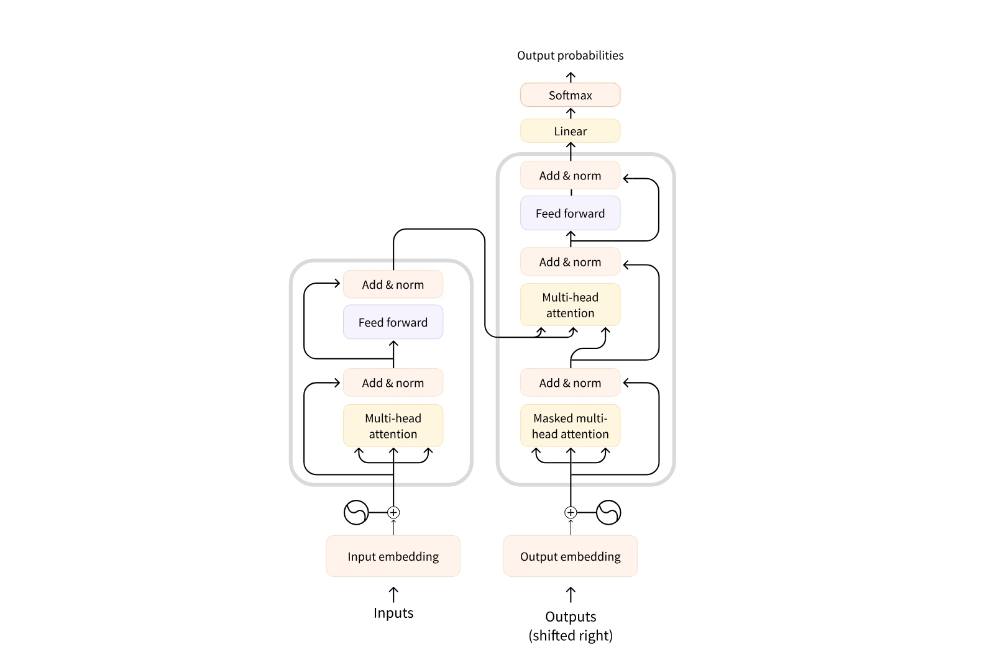
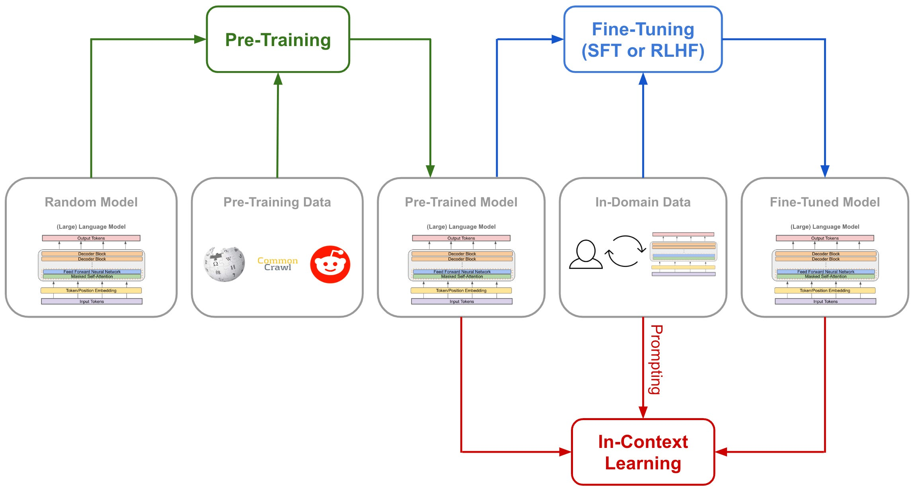
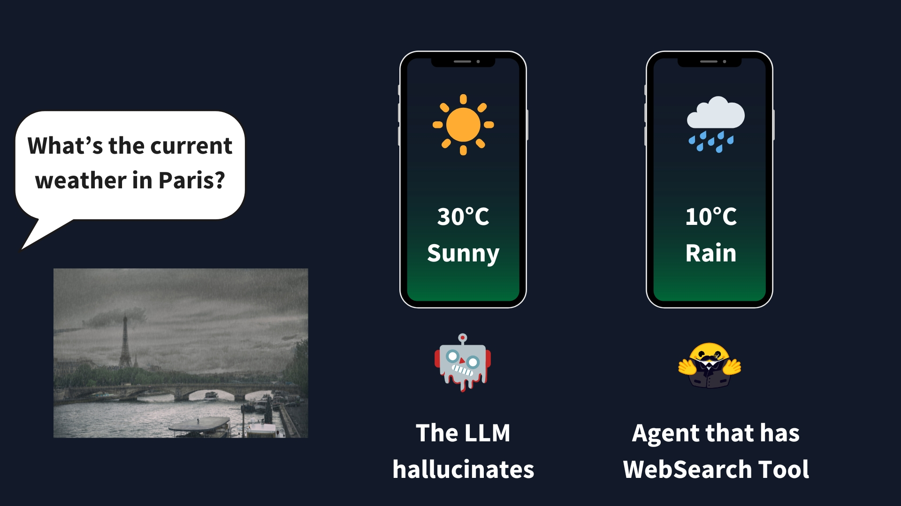
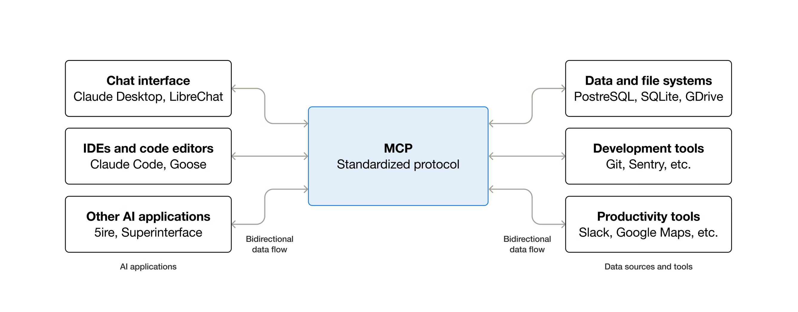

 <h1 style="text-align:center;font-weight:normal;font-size:3em;">
     Prompt Hacking: Técnicas ofensivas y defensivas en la era de la IA
 </h1>

---

# ¿Quién soy?

<div style="text-align:center;">
    <h4 style="font-size:1.25em;margin:5px;">Cristian Cardellino</h4>
    <h5 style="font-style:normal;font-size:1em;margin:5px;">AI Research & Engineering @ Eclypsium</h5>
    <div style="display:inline-block;margin-right:20px;">
        
    </div>
    <h6 style="font-style:normal;font-size:0.9em;margin:5px;">
        <a href="https://crscardellino.net" style="color:royalblue;" target="_blank">https://crscardellino.net</a>
    </h6>
</div>

---

# Objetivos del Curso

- Comprender qué son y cómo funcionan los modelos de lenguaje masivos y cómo pueden ser vulnerados.
- Entender las distintas técnicas de prompt hacking y sus efectos en aplicaciones que se construyen sobre motores de IA.
- Analizar los riesgos y consecuencias de los ataques de prompt hacking.
- Desarrollar habilidades para identificar y mitigar ataques prompt hacking.

---

<h1 style="text-align:center;font-weight:normal;font-size:3em;">Introducción a LLMs</h1>

---

# ¿Qué es un LLM?

---

## ¿Cómo continúa esta frase?

<h2 data-marpit-fragment="1" style="text-align:center;font-weight:normal;font-size:1.25em;">You ...</h2>
<h2 data-marpit-fragment="2" style="text-align:center;font-weight:normal;font-size:1.25em;">You shall ...</h2>
<h2 data-marpit-fragment="3" style="text-align:center;font-weight:normal;font-size:1.25em;">You shall not ...</h2>
<div data-marpit-fragment="4" style="text-align:center;">
    <h2 style="font-weight:normal;font-size:1.25em;">You shall not pass!</h2>
    <div style="display:inline-block;margin-top:10px;">
        
    </div>
</div>

---

## ¿Cómo funcionan los LLMs y qué tipos existen?

- Los modelos de lenguaje (o Language Models) son modelos que buscan emular el lenguaje humano.
- Dado un contexto de entrada (e.g., una lista de palabras) predicen la salida (e.g., la palabra siguiente a la lista de palabras del contexto).
    - No todos los modelos de lenguaje son LLMs y algunos ni siquiera son probabilísticos (e.g., las gramátias de Chomsky).
- Los modelos masivos de lenguajes (Large Language Models o LLMs) son modelos probabilísticos de aprendizaje automático entrenados con una gran cantidad de datos y de parámetros:
    - Suelen entrenarse con corpus del orden de $10^{10}$ tokens.
    - Suelen tener de $10^8$ o $10^9$ parámetros en adelante.
    - El término se asocia generalmente a aquellos modelos basados en la arquitectura neuronal del Transformer.

---

## ¿Qué es un "Transformer"?

- Es una arquitectura de red neuronal que se presentó en el paper ["Attention is All You Need"](https://arxiv.org/abs/1706.03762).
- Existen variantes, de acuerdo a que parte de la arquitectura usan:
    - Los modelos de traducción de secuencia a secuencia (e.g. el [Transformer](https://arxiv.org/abs/1706.03762) o el [T5](https://arxiv.org/abs/1910.10683)). Tienen codificador y decodificador. Sirven para tareas de transformación (e.g. traducción).
    - Los modelos basados en el codificador (e.g. [BERT](https://arxiv.org/abs/1810.04805)). Sirven para buscar representaciones vectoriales (embeddings) del texto.
    - Los modelos basados en el decodificador, o autoregresivos (e.g., [GPT](https://arxiv.org/abs/2005.14165)). Sirven para generación de texto.
- La idea del transformer es "definir" una palabra de acuerdo a la relación que tiene con las palabras de su vecindario, en una operación de multiplicación matricial con pesos.
    - Para una explicación sencilla pero más detallada sugiero los posts de la serie "The Illustrated..." de [Jay Alammar](http://jalammar.github.io/):
        - [The Illustrated Transformer](http://jalammar.github.io/illustrated-transformer/)
        - [The Illustrated BERT](http://jalammar.github.io/illustrated-bert/)
        - [The Illustrated GPT-2](http://jalammar.github.io/illustrated-gpt2/) / [How GPT-3 Works](http://jalammar.github.io/how-gpt3-works-visualizations-animations/)

---

## Arquitecturas de Transformers

<div style="text-align:center;">
    <div style="display:inline-block;margin-right:20px;">
        
    </div>
    <h6 style="font-style:normal;font-size:1em;margin:5px;">
        Source: <a href="https://huggingface.co/learn/agents-course/en/unit1/what-are-llms" style="color:royalblue;" target="_blank">Hugging Face Agents Course - What are LLMs?</a>
    </h6>
</div>

---

## ¿Cómo se entrena un LLM?

<div style="text-align:center;">
    <div style="display:inline-block;margin-right:20px;">
        
    </div>
    <h6 style="font-style:normal;font-size:1em;margin:5px;">
        Source: <a href="https://cameronrwolfe.substack.com/p/understanding-and-using-supervised" style="color:royalblue;" target="_blank">Cameron Wolfe - Deep Learning Focus - Understanding and Using Supervised Fine-Tuning (SFT) for Language Models</a>
    </h6>
</div>

---

## ¿Qué es la tokenización?

- Los LLMs (y más generalmente cualquier algoritmo de ML) no reconocen texto, sólo números.
    - En particular usan IDs para determinar las palabras que tienen de contexto y que tienen que predecir.
- La tokenización es el proceso de tomar una secuencia de texto y dividirla en partes más chicas, llamadas tokens.
    - Los tokens pueden ser palabras, subpalabras, caracteres, números, símbolos, etc.
    - Distintos niveles de granularidad ofrecen diversos pros y contras dependiendo de la tarea.
    - Los tokens dependen mucho del idioma con el que se trabajan.
- La tokenización sirve para dividir el texto de forma que los modelos puedan procesarlo y tener contexto para reconocer patrones.

---

## Tipos de Tokenización

- Dependiendo de la granularidad, hay distintos tipos de tokenización.
- La tokenización a nivel palabra crea un token por cada palabra del vocabulario.
    - Es útil para idiomas donde las palabras tengan límites claro (e.g., Español, Inglés, etc.).
    - Cada forma de una palabra es un token, por lo que el vocabulario puede ser enorme.
    - No maneja palabras fuera de vocabulario.
- La tokenización a nivel caracter crea un token por cada caracter (incluídos espacios, signos, etc.).
    - Útil para idiomas con límites poco claros en las palabras y también para aplicaciones específicas.
    - Puede haber mucha pérdida semántica en algunos casos.
- La tokenización de subpalabras busca un punto medio entre las tokenizaciones anteriores.
    - Se basa en la interpretación semántica de subpalabras de acuerdo al contexto (e.g., chatbot = "chat" + "bot").
    - Muy útil para armar palabras con un enfoque "bottom-up" (i.e., tokens pequeños crean tokens más grandes).
    - Tiene más granularidad y no sufre de problemas de fuera de vocabulario.
    - Conservan mayor valor semántico en comparación a la tokenización a nivel caracteres.
    - La gran mayoría de los LLMs modernos usan algún algoritmo de tokenización por subpalabras.
    - Existen varios algoritmos de tokenización de subpalabras, los más conocidos son [BPE](https://huggingface.co/docs/transformers/en/tokenizer_summary#byte-level-bpe), [WordPiece](https://huggingface.co/docs/transformers/en/tokenizer_summary#wordpiece), [Unigram](https://huggingface.co/docs/transformers/en/tokenizer_summary#unigram) y [SentencePiece](https://huggingface.co/docs/transformers/en/tokenizer_summary#sentencepiece)

---

## Visualizando un LLM

---

### Mecanismo de atención

<div style="text-align:center;">
    <div style="display:inline-block;margin-right:20px;">
        
    </div>
    <h6 style="font-style:normal;font-size:1em;margin:5px;">
        Source: <a href="https://huggingface.co/learn/agents-course/en/unit1/what-are-llms" style="color:royalblue;" target="_blank">Hugging Face Agents Course - What are LLMs?</a>
    </h6>
</div>

---

### Predicción de la palabra siguiente

<div style="text-align:center;">
    <div style="display:inline-block;margin-right:20px;">
        
    </div>
    <h6 style="font-style:normal;font-size:1em;margin:5px;">
        Source: <a href="https://huggingface.co/learn/agents-course/en/unit1/what-are-llms" style="color:royalblue;" target="_blank">Hugging Face Agents Course - What are LLMs?</a>
    </h6>
</div>

---

### Generación autoregresiva

<div style="text-align:center;">
    <div style="display:inline-block;margin-right:20px;">
        
    </div>
    <h6 style="font-style:normal;font-size:1em;margin:5px;">
        Source: <a href="https://huggingface.co/learn/agents-course/en/unit1/what-are-llms" style="color:royalblue;" target="_blank">Hugging Face Agents Course - What are LLMs?</a>
    </h6>
</div>

---

## ¿Qué es un embedding?

- Los embeddings son representaciones vectoriales de entidades (e.g., tokens, palabras, documentos, registros, etc.).
- Se crean con el objetivo de conservar las similitudes semánticas de las entidades que representan.
- Las dimensiones de los embeddings representan rasgos latentes.
- Existen distintos algoritmos para calcular embeddings.
- Los embeddings suelen arrancar como vectores aleatorios que son ajustados a lo largo del entrenamiento.
- Si quieren una explicación más detallada les sugiero ver mi [charla en Nerdearla 2021](https://www.youtube.com/watch?v=_RvSQsV12fM) o leer el fantástico post de [Jay Alammar](https://jalammar.github.io/illustrated-word2vec/).

---

# ¿Qué es un prompt?

---

## La semilla en un modelo de lenguaje

- Los modelos de lenguaje son máquinas sin estado.
    - No tienen concepto de memoria, estado interno, o estado inicial.
- Sirven específicamente para continuar a partir de una entrada inicial.
- Un prompt es la semilla inicial sobre la que un modelo puede continuar.
    - E.g., un prompt para especificar al LLM que debe traducir al usuario de español a inglés.
- Durante la fase de alineamiento los modelos aprenden a completar prompts de formatos específicos.

<span data-marpit-fragment="1">

```
<|begin_of_text|><|start_header_id|>system<|end_header_id|>

Cutting Knowledge Date: December 2023
Today Date: 10 Feb 2025

<|eot_id|><|start_header_id|>user<|end_header_id|>

I need help with my order<|eot_id|><|start_header_id|>assistant<|end_header_id|>

I'd be happy to help. Could you provide your order number?<|eot_id|><|start_header_id|>user<|end_header_id|>

It's ORDER-123<|eot_id|><|start_header_id|>assistant<|end_header_id|>
```

</span>

---

## Roles y Prefill

- Las APIs de chat estructuran el prompt en mensajes con roles: `system`, `user` y `assistant`.
- Algunas APIs permiten *prefill*: escribir el comienzo del mensaje del `assistant` para que el modelo lo continúe.
- Es una técnica legítima de control de formato (e.g., forzar que la respuesta empiece con `{` para obtener JSON).
- Como el modelo continúa aquello que "ya dijo", el prefill también es un vector de ataque.
- Varios proveedores lo fueron retirando en sus modelos más nuevos.

---

## ¿Qué es una ventana de contexto?

- Los LLMs están limitados a una máxima cantidad de palabras a procesar.
- Esto se lo conoce como "ventana de contexto" y determina la cantidad de palabras que el LLM puede "ver" en un instante de tiempo determinado.
    - Un transformer no puede "leer" más palabras que las que su contexto permite.
    - También suelen tener problemas de "interpretación" mientras más grande sea el contexto.
- Muchas técnicas ofensivas tienden a usar estos extremos como vectores de ataque.

---

## ¿Qué significa zero, one y few shot?

- Los LLMs son, por sobre todo, *pattern matchers* (i.e., pueden identificar patrones y continuarlos).
    - Es por esto que logran seguir una "conversación" con cierto tono (ya sea formal, informal, o hacerlos hablar [como piratas](https://simonwillison.net/2023/Apr/14/worst-that-can-happen/#gpt4)).
- Zero-shot es el caso cuando no se da ningún ejemplo contextual.
    - Esto es muy típico cuando se le pregunta al LLM algún tipo de información que sea de común conocimiento.
- One-shot es cuando se le establece un solo ejemplo de contexto.
    - Esto es muy últil cuando se espera que el LLM devuelva algo en algún formato específico (e.g., un JSON).
- Few-shot es cuando se le establecen varios ejemplos para el contexto.
    - Se suele utilizar en tareas no tan "comunes" o porque hay más de un ejemplo de como puede realizarse.

---

## ¿Qué es Retrieval Augmented Generation (RAG)?

- Los LLMs son muy buenos para generar texto, pero son muy malos como bases de datos.
- Sólo aquellos datos que tengan mucha repetición en el dataset de entrenamiento son más certeros.
- Con el contexto correcto son muy buenos para comunicar esos datos.
    - Esto es por el mismo mecanismo de atención de los LLMs hace que hagan más hincapié en lo que está explícito en su contexto por sobre lo que está implícito en sus pesos internos.
- El Retrieval Augmented Generation (o RAG) es una técnica para explotar esta última ventaja de los LLMs:
    - Pone en el contexto del LLM información que haya sido obtenida de algún medio externo confiable.
    - En general se utilizan bases de datos sobre las que se pueda hacer algún tipo de búsqueda semántica (e.g., usando embeddings).
    - La idea es tomar una query, buscar los conceptos semánticamente más similares en la base de datos y agregarlos al prompt e indicarle que responda en base a esos datos.

```
Use the following pieces of context to answer the question at the end. If you don't know the answer, just say that you don't know, don't try to make up an answer.

{context}

Question: {question}
Answer:
```

---

## ¿Qué es chain-of-thought y qué son los LRMs?

- Los LLMs son generadores de texto por sobre todo. Sin embargo, desde el principio se buscó que pudieran razonar.
- Unos de los desafíos más grandes de los LLMs se da en problemas lógicos, cuando se les da un enunciado coloquial, los LLMs dan respuestas erróneas.
    - Se olvidan detalles, o intentan hacer operaciones matemáticas y con resultados inexactos.
    - Algunos problemas son solucionables mediante el uso de herramientas externas (e.g., indicar al LLM que haga el cálculo con algún programa).
- El estudio de las mecánicas de razonamiento derivó en lo que se llamó [Chain-of-Thought Prompting](https://arxiv.org/abs/2201.11903) donde a un LLM se le dan parámetros para que pueda resolver el problema especificado paso a paso.
    - Agregar ejemplos (i.e., few shot) y frases claves como "let's break down the process into steps" mostró que los LLMs mejoraban su proceso de razonamiento.
- A partir de esa idea se empezaron a idear los _Large Reasoning Models_ (o LRMs).
    - Estos modelos generan "tokens de razonamiento" que usan para "pensar" y facilitar la resolución de problemas más complejos.

---

## La Traza de Razonamiento como Objeto de la API

- Los LRMs generan una traza de razonamiento antes de responder, y esa traza no siempre se muestra al usuario.
- Los proveedores la devuelven al cliente en bloques cifrados (e.g., el campo `reasoning.encrypted_content` en la API de OpenAI) para poder reinyectarla en turnos posteriores sin exponer su contenido.
- Es decir: son datos que viajan de ida y de vuelta entre cliente y servidor, no un estado interno inaccesible del modelo.
- Eso convierte a la traza en una superficie de ataque propia.

---

# Agentes y Arneses

---

## Agentes

- Los agentes son un rol y una estrategia de prompt basada en un "loop de razonamiento".
- Suelen tener asociado un rol que los "especializa" (e.g., "eres un experto en seguridad").
- Los prompts que los construyen con un patron de diseño que "mejora" la capacidad del LLM de un simple generador de texto a un "resolutor de problemas".
- Establece que herramientas (*tools*) puede el LLM utilizar para resolver los problemas que tenga y un diseño de "cómo razonar" (Re-Act pattern).
- Varios agentes especializados se pueden comunicar para ejecutar distintas tareas.
- El LLM sigue siendo el que "razona" y toma las decisiones, los agentes le facilitan la estrategia para hacerlo.

---

## Arneses (Harness)

- El arnés es el que "conecta" al agente con el mundo.
- Es el que le permite al LLM tener "memoria".
- Se encarga de parsear las acciones que el Agente le indica y realizar las tareas mediante las herramientas disponibles.
- Es el que lee y escribe archivos, ejecuta código, y en general interactúa con el entorno.
- El agente y el arnés están muy relacionados, uno no puede existir sin el otro.
- El arnés es el principal ejecutor de ataques de prompt injection porque es el que tiene el poder real.

---

## ¿Qué son herramientas?

- Los LLMs no son capaces de ejecutar nada, sólo generan texto.
- Las "herramientas" son la forma principal de interacción entre el LLM y el entorno via el arnés.
    - Algo para hacer un cálculo, leer un archivo, explorar un directorio, etc.
- Las herramientas son llamadas por el modelo mediante un patrón definido, generalmennte un JSON, que es interpretado por el agente y ejecutado por el arnés.
    - El patrón es el nombre de la herramienta y sus parámetros.

---

### Ejemplo de una herramienta

<div style="text-align:center;">
    <div style="display:inline-block;margin-right:20px;">
        
    </div>
    <h6 style="font-style:normal;font-size:1em;margin:5px;">
        Source: <a href="https://huggingface.co/learn/agents-course/en/unit1/tools" style="color:royalblue;" target="_blank">Hugging Face Agents Course - What Are Tools?</a>
    </h6>
</div>

---

## ¿Qué es Re-Act?

- ReAct es una estrategia en el prompt de un agente para seguir un ciclo de Razonamiento, Acción y Observación:
    - El razonamiento es del LLM, se basa en diagramar las acciones a seguir.
    - La acción la ejecuta el arnés.
    - La observación es mediante la interpretación del resultado de la acción.
- Esto es en un ciclo (loop) hasta que el modelo decide que la respuesta es satisfactoria.

<div style="text-align:center;">
    <div style="display:inline-block;margin-right:20px;">
        
    </div>
    <h6 style="font-style:normal;font-size:1em;margin:5px;">
        Source: <a href="https://huggingface.co/learn/agents-course/en/unit1/agent-steps-and-structure" style="color:royalblue;" target="_blank">Hugging Face Agents Course - Understanding AI Agents through the Thought-Action-Observation Cycle</a>
    </h6>
</div>

---

## ¿Qué es Model-Context Protocol (MCP)?

- El problema de acceder a recursos (e.g., bases de datos, ejecución de código, etc.) es que se requiere una API distinta por cada agente/LLM, con N agentes y M recursos se necesitan NxM maneras de conectarlos.
- [Model-Context Protocol (MCP)](https://modelcontextprotocol.io/docs/getting-started/intro) es un estándar abierto diseñado por Anthropic para establecer una conexión común entre agentes en aplicaciones clientes y servidores que ofrecen distintos recuros.

<div style="text-align:center;">
    <div style="display:inline-block;margin-right:20px;">
        
    </div>
    <h6 style="font-style:normal;font-size:1em;margin:5px;">
        Source: <a href="https://modelcontextprotocol.io/docs/getting-started/intro" style="color:royalblue;" target="_blank">Model Context Protocol Documentation</a>
    </h6>
</div>

---

## Agentes de Código

- Son hoy la aplicación de agentes con mayor adopción: Claude Code, Cursor, GitHub Copilot Agent, Antigravity.
- Combinan tres características:
    - Leen archivos del repositorio como contexto, incluyendo archivos de reglas e instrucciones (`CLAUDE.md`, `AGENTS.md`, `.cursorrules`).
    - Tienen acceso a herramientas de sistema: shell, lectura y escritura de archivos, acceso a red.
    - Corren de manera prolongada y autónoma, muchas veces sin que se supervise cada paso.
- Casi todo lo que leen es contenido no confiable: issues, comentarios de pull requests, dependencias, páginas web, salidas de comandos.
- Los modos de permisos automáticos reemplazan la aprobación humana por un clasificador que decide qué comandos se ejecutan sin preguntar.

---

## Memoria en Agentes

- Muchos sistemas agregan memoria persistente entre sesiones: preferencias del usuario, hechos, notas que el propio agente escribe.
    - La memoria de ChatGPT, los proyectos de Claude, archivos de notas que el agente vuelve a leer al empezar.
- A diferencia de la ventana de contexto, la memoria sobrevive al fin de la conversación y se reinyecta automáticamente en las siguientes.
- Es un componente más del agente y, como todo lo que entra al contexto, puede terminar siendo escrito por un atacante.
